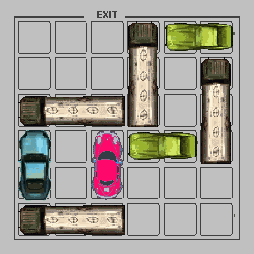

# Rush Hour - AI Solver

The goal of this assignment will be to implement a working solver for the puzzle game Rush Hour shown in Figure 1.

The puzzle involves moving a goal car, that may be blocked by additional cars and trucks, to an exit. Cars and trucks can only move in straight lines. The game can be played online here: http://www.thinkfun.com/play-online/rush-hour/.

## Description of the Puzzle
The Rush Hour puzzle has the following formal description. Note that our version differs from the standard one.
*The puzzle is played on a grid board with dimensions M rows by N columns.
*The board has V vehicles on it. Each vehicle v has several properties:
	*`<v.loc>` is the vehicle’s initial position `<(x.y)>`, counted from the upper left corner of the grid, e.g.`<(0, 0)>` would be the upper left corner and `<(M − 1, N − 1)>` would be the bottom right corner.
	*`<v.is_horizontal>` indicates whether `<v>` is horizontal, i.e., parallel to the x-axis. If `<v>` is not horizontal, it is parallel to the `<y-axis>`.
	*`<v.length>` is the length of `<v>`, i.e., the number of units that it extends in the positive direction of its orientation.
	*`<v.is_goal>` indicates whether `<v>` is the vehicle that you must move to the goal (i.e. the “goal vehicle”).

	For example, the red vehicle in Figure 1 would have `<v.loc = (2, 3)>`, `<v.is_horizontal = False>`, `<v.length = 2>`, `<v.is goal = True>` (traditionally, red indicates the vehicle to move to the exit in a Rush Hour puzzle).

*A move consists of moving any single vehicle one unit in either direction along its axis of movement: a horizontal vehicle can only move parallel to the x-axis and a vertical vehicle can only move parallel to the y-axis. A vehicle can only move into a space that is not occupied by another vehicle. Note that in in our version of the puzzle, the board has no walls at the edges; a vehicle that drives off the board on one side will reappear on the other. For example, in Figure 1, the green car in the upper right could move one tile to the right and end up occupying the tiles `<(0, 5)>` and `<(0, 0)>`.

*The goal `<g>` is represented by a location `<g.loc = (x, y)>` and an orientation `<g.orientation ∈ { 0 N 0 , 0 E 0 , 0 S 0 , 0 W 0 }>`. The objective of the puzzle is to move a goal vehicle `<gv>` to the goal location such that the goal vehicle is touching the goal entrance and in the correct orientation to enter the goal. For example, consider the board of `<Figure 1>`, disregarding the walls at the edges. The goal has location `<(2, 0)>` and orientation `<0 N 0>`. Having the goal vehicle at location `<(2, 0)>` would be the unique goal state. If the goal was at `<(2, 0)>` and oriented `<0 S 0>` , then `<(2, 5)>` would be the unique goal state. In this state, the goal vehicle would be wrapped around the board, and occupying both `<(2, 5)>` and `<(2, 0)>`. Note that in our version of the puzzle, a goal can be located anywhere on the board, not just at board boundaries.</li>

## Features:
*Implement a state representation for this problem and a successor state function to keep track of at least the following items in the state object:
	*The properties of each vehicle, including its location.
	*The board properties, including size, goal entrance and direction.

*Implement the successor state function for class rushhour. In particular, your successor state function should implement the action move `<vehicle(<vehicle name>, <direction>)>`, where direction is one of `<{ 0 N 0 , 0 E 0 , 0 S 0 , 0 W 0 }>`. States produced by your function will have to record the actions that preceded them; i.e. they should incorporate action names of the form move `<vehicle(<vehicle name>, <direction>)>`.
*Implement a make init state function that creates an initial state object from a puzzle specification. Details are in rushhour.py.
*Implement a set of data access methods for your rushhour state objects. Details are in rushhour.py.
*Implement a heuristic for this domain so that you can use A* search. Details are in rushhour.py.

[Read More](csc384w16_a1.pdf)
